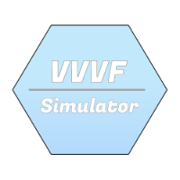
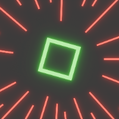

<div align="center">


# Create: VVVF-Simulator
Simulates VVVF on Minecraft Create Train
</div>

## Features


- Realtime VVVF wave simulation without premade audio
- Config delivery from server ensure remote or cross-dimension speed continuity
## Dependencies
[](https://github.com/Creators-of-Create/Create)
## Recommendations

The following Create server train configs are recommended
```toml
[trains]
manualTrainSpeedModifier=1
[trains.trainStats]
trainTopSpeed=32
trainTurningTopSpeed=28
trainAcceleration=1
[trains.poweredTrainStats]
poweredTrainTopSpeed=32
poweredTrainTurningTopSpeed=28
poweredTrainAcceleration=1
```
## Run
### Environments
- Client necessary
- Server optional

| Behaviour          | Server available    | Server unavailable    |
|--------------------|---------------------|-----------------------|
| Client available   | Full part functions | Client side functions |
| Client unavailable | Compatible          | -                     |
### Pre-build


[](https://modrinth.com/mod/create_vvvf_simulator)
[]()
[](https://github.com/Deiloproxide/Create-VVVF-Simulator/releases)
### Build from source


## Contributions
Your contributions to our [project](https://github.com/Deiloproxide/Create-VVVF-Simulator) are well-welcome!
Please feel free to feed back issues, make comments or submit a pull request
## Thanks
Some parts of this project's code were ported or adapted from the following projects.
Thanks to the creators of following projects!

[](https://github.com/VvvfGeeks/VVVF-Simulator)
[](https://github.com/henkelmax/sound-physics-remastered)
[](https://github.com/FalseMSP/SoundPhysicsPerfected)
## Contact us
[](https://github.com/Deiloproxide)